# Отчет по утечкам памяти
## Главная страница
### Загрузка страницы с нуля
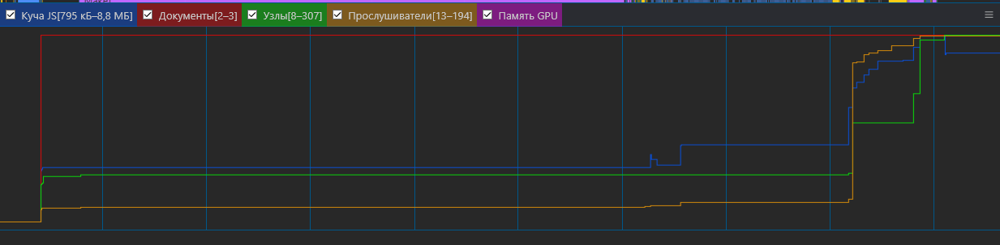
### Нажатие кнопки начать играть
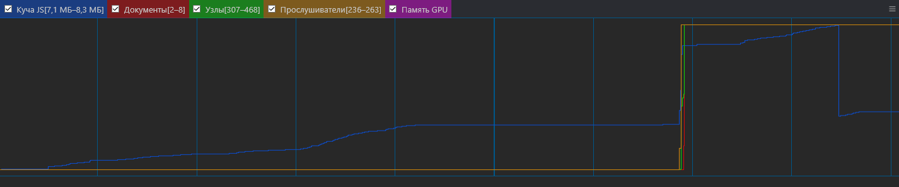
## Проифль
### Загрузка страницы с нуля
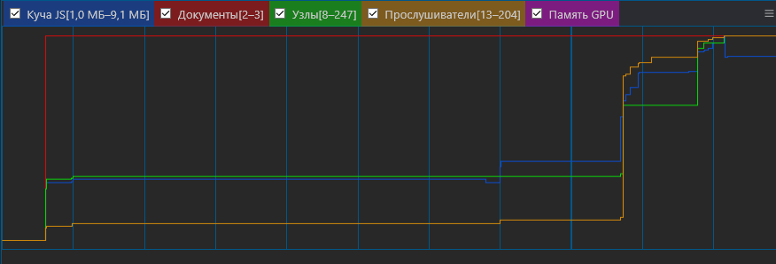
### Изменение данных
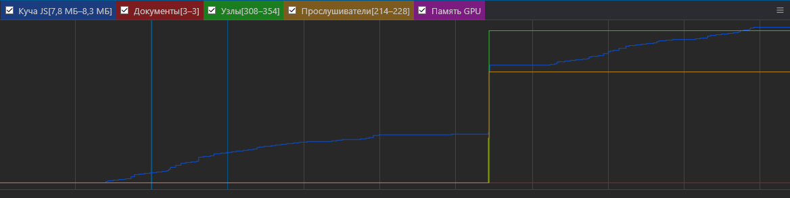
### Изменение пароля
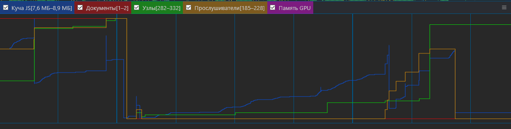
### Изменение аватара
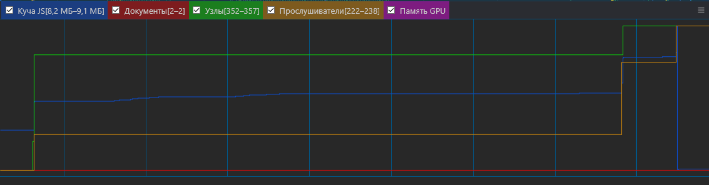
## Форум
### Загрузка страницы с нуля
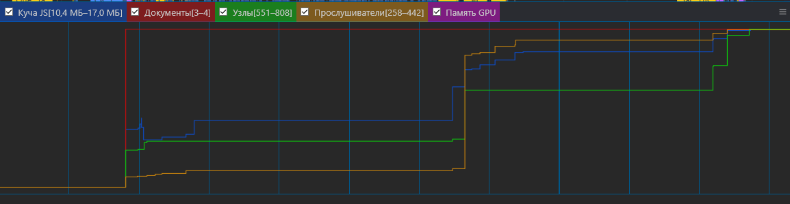
### Создать топик
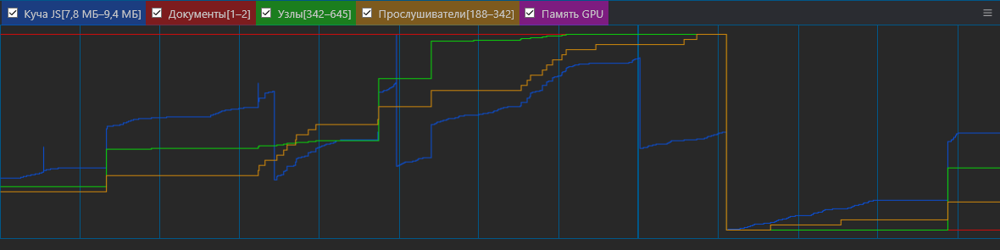
### Открытие топика
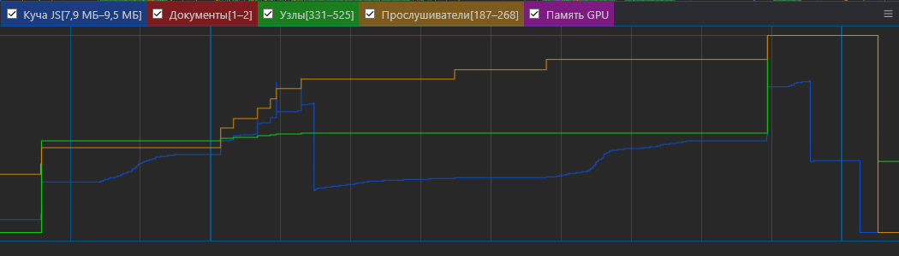
## Лидерборд
### Загрузка страницы с нуля(Здесь почему-то не успевает очистить мусор за 5 секунд)
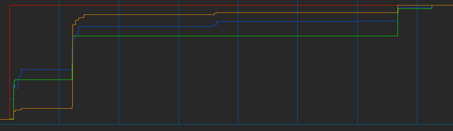
### В простое
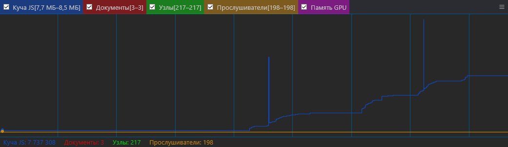
И здесь уже 8,5МБ памяти, но есть скачки-_-
## Переход на страницу лидерборда
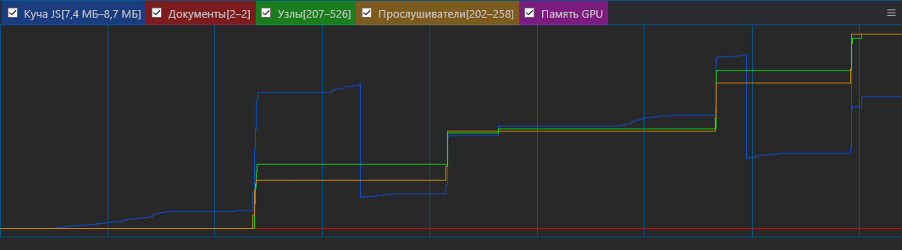
И тут уже всё ок
## Выход из аккаунта
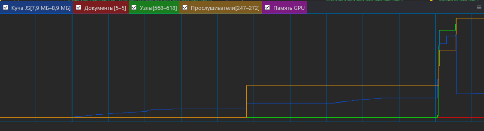
## Вход через логин + пароль
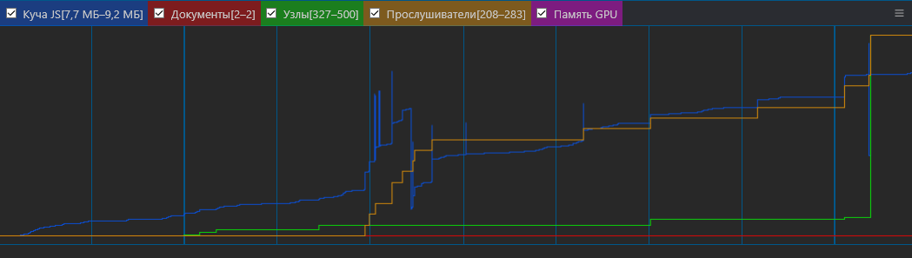
### Игра
## Первая часть(70сек)
Скачки обусловлены частыми ререндерами, 
но в целом память почти не растёт
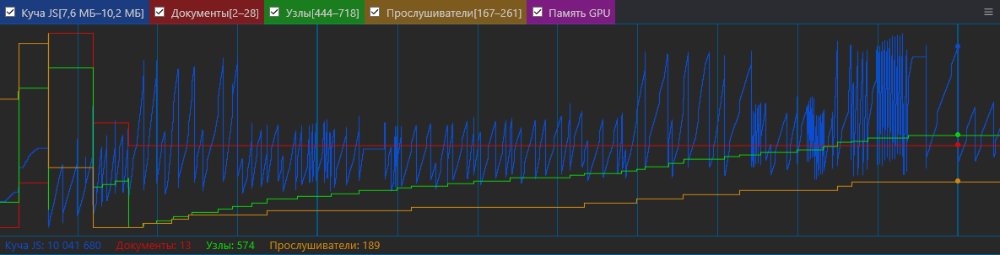
## Вторая часть(90сек)

## Конец игры
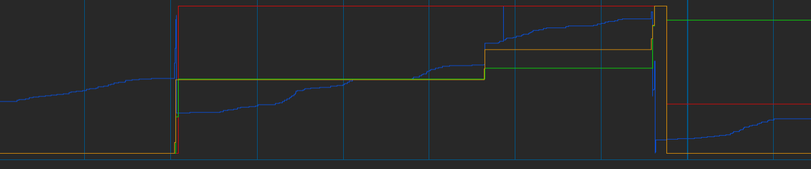

В целом утечек нету