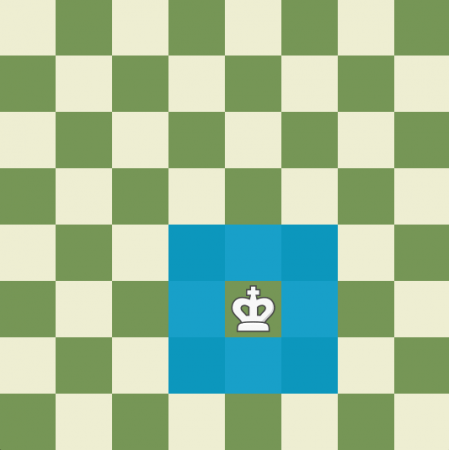
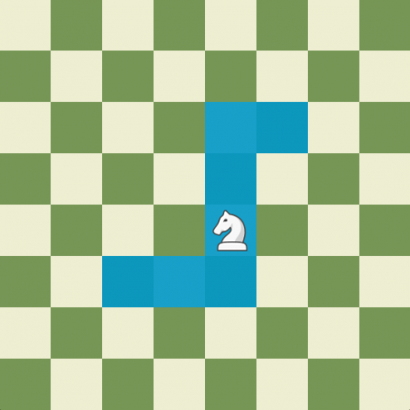

# Сценарий игры(Шахматы)
Изначально игра для двух игроков, в которой 
они поочерёдно перемещают фигуры на поле 8x8 клеток 
с целью поставить мат королю противника. С каждой стороны в игре учавствую 8 фигур
(король, ферзь, две ладьи, по два слона и коня) и 8 пешек. Один игрок играет белыми
фигурами, другой чёрными.

# Фигуры и их возможные ходы
## Король(King)
Перемещается на одно поле в любом направлении(вертикали, горизонтали и диагонали)   
   

## Королева или Ферзь(Queen)
Может передвигаться на любое расстояние назад и вперёд по прямой или диагонали(вертикали, горизонтали и диагонали)    
   

## Слон(Bishop)
Ходит по диагонали на любое расстояние  
   

## Конь(Knight)
Конь ходит нестандартно — буквой «Г»: три поля вперёд и на одну клетку вправо или влево. 
Из-за этого в конце хода всегда оказывается на поле противоположного цвета. 
Только конь может перепрыгнуть через другую фигуру — свою или чужую.   
   

## Ладья(rook/castle)
Может передвигаться по прямой на любое кол-во клеток(вертикали и горизонтали)   
   

## Пешка(Pawn)
Ходит на один шаг `только вперёд`, если ход первый, то на два. 
Представителей армии противника они атакуют `исключительно по диагонали`.
Если пешка достигнет противоположного `края доски`, она получает право на `превращение` - стать конем, слоном, ладьей или ферзем, и получить больше возможностей для передвижения.   
   

# Классическая начальная расстановка
Правила расстановки довольно просты. 
На крайних клетках в первом ряду стоят ладьи, за ними ставятся кони и слоны. 
Центральные клетки первого ряда предназначены для главных фигур. 
Для ферзя предусмотрена клетка одного с ним цвета, он любит свой цвет! 
Где стоит король - рядом с ферзем. 
Во втором ряду доски перед ними расставляются пешки, играющие роль рядовых вашей настольной армии. 
Именно им предстоит делать первый ход, подставляться под удар, защищая короля. 
Такое расположение фигур считается классическим.   

# Правила
1) Игру начинают `всегда` белые фигуры
2) Ходы делают поочерёдно, по 1 фигуре
3) У каждой фигуры свои правила хода
# Окончания игры
## Ничья
Ничья называется пат. Суть ее состоит в том, что у 
одного из участников больше нет ходов, но при этом мат не поставлен. 
В этом случае партия завершается.
Кроме того, партия заканчивается вничью, если позиции фигур в сражении повторяются трижды 
или на доске у игроков остается очень мало материала, недостаточного для объявления мата сопернику.
# Шах и Мат
Шах это ситуация, когда король находится под ударом какой-либо фигуры, 
нельзя сделать ход, который не будет спасать короля, если такого хода не будет, то получится мат.
Мат – это капитуляция всей шахматной армии, 
которая не смогла защитить своего главнокомандующего, и он попал в расставленные противником сети. 
Чем быстрее он поставлен, тем выше считается квалификация участника. Победу в турнирах подтверждают арбитры,
внимательно следящие за ходом битвы и не допускающие ни одного невозможного хода
# Нотация
Нотация – это схема условных знаков, предназначенных для записи шахматной партии, 
которую должны знать даже начинающие игроки. 
Это необходимо для того, чтобы научиться:
* Самостоятельно записывать игровые партии;
* Читать и понимать специальную литературу;
* Играть «в слепую»
* Разбирать уже сыгранные партии с целью их анализа и работы над ошибками.
## Свое обозначение имеет и каждый персонаж:
* Кр (К) – король;
* Ф (Q) – ферзь;
* Л (R) – ладья;
* К (N) – конь;
* С (C) – слон;
* П (p) – пешка.
## Система знаков
* `+ - шах;` 
* `++ - двойной шах;`
* `# - мат;`
* `Х – взятие фигуры;`
* `0-0 – рокировка;`
* `!! – отличный ход;`
* `?? – грубая ошибка и т.д.`
# Fen-нотация(используется для API)
Пример: `8/1P1R4/n1r2B2/3Pp3/1k4P1/6K1/Bppr1P2/2q5 w - - 0 1 `  
Описывает расположение фигур на доске. Строки разделены символом /.
Каждая строка описывает горизонталь (ряд) доски, начиная с 8-й горизонтали (для белых) до 1-й.
Прописные (заглавные) буквы — белые фигуры: P (пешка), R (ладья), N (конь), B (слон), Q (ферзь), K (король).   
Строчные буквы — чёрные фигуры: p, r, n, b, q, k.
`8/1P1R4/n1r2B2/3Pp3/1k4P1/6K1/Bppr1P2/2q5`  
8 - вся восьмая горизонталь свободна   
1P1R4 — на 7-й горизонтали: пустая клетка, белая пешка (P), пустая клетка, белая ладья (R), затем 4 пустые клетки.
И т.д
`w - - 0 1`   
`w` - white, ход белых   
`-` - рокировка невозможна для обеих сторон   
`-` - нет битого поля для взятия на проходе   
`0` - количество полуходов с последнего хода пешки или взятия   
`1` - текущий ход  
Вот как выглядит доска в данном примере   

# TODO:
- [ ] Сделать возможность игры двух людей на одном устройстве

# В задумке:
- [ ] Возможность игры с ИИ
- [ ] Возможность игры двух на разных устройствах